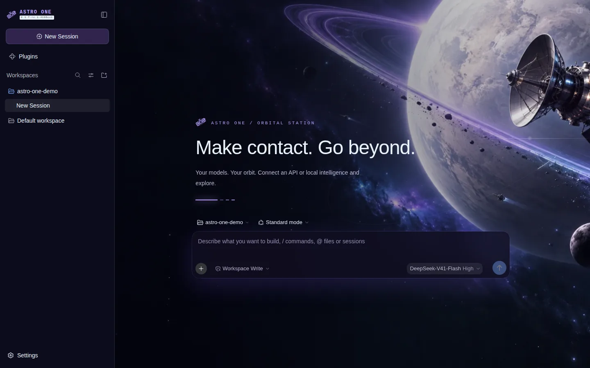
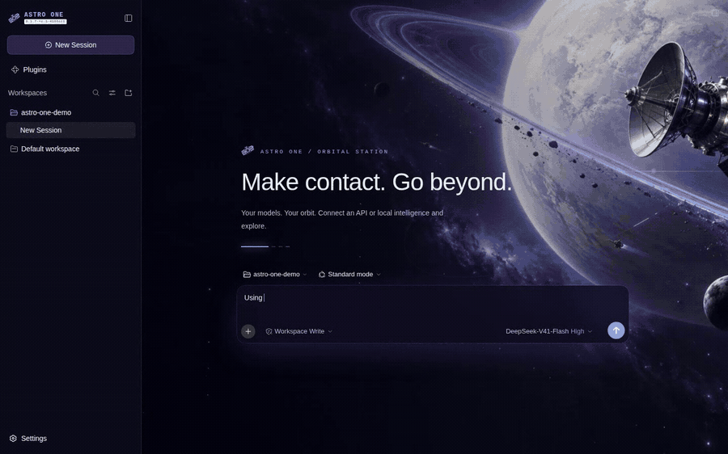
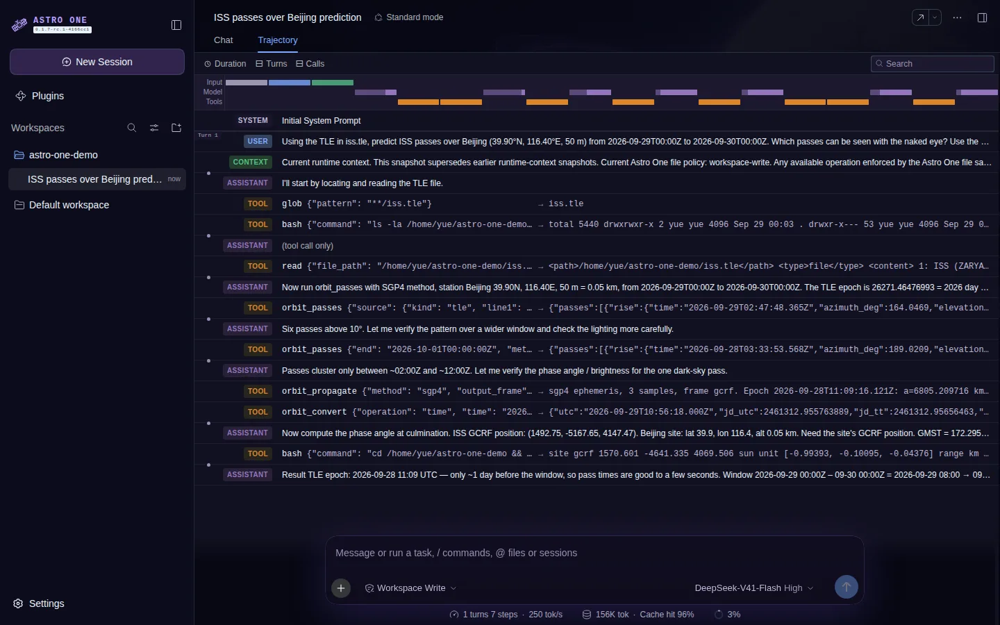
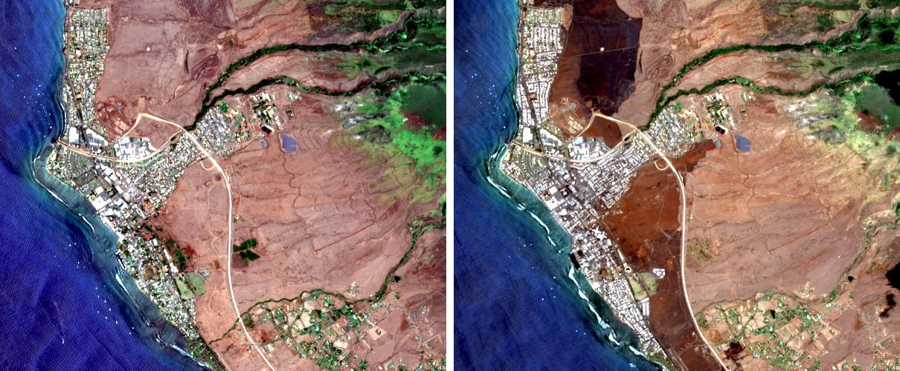
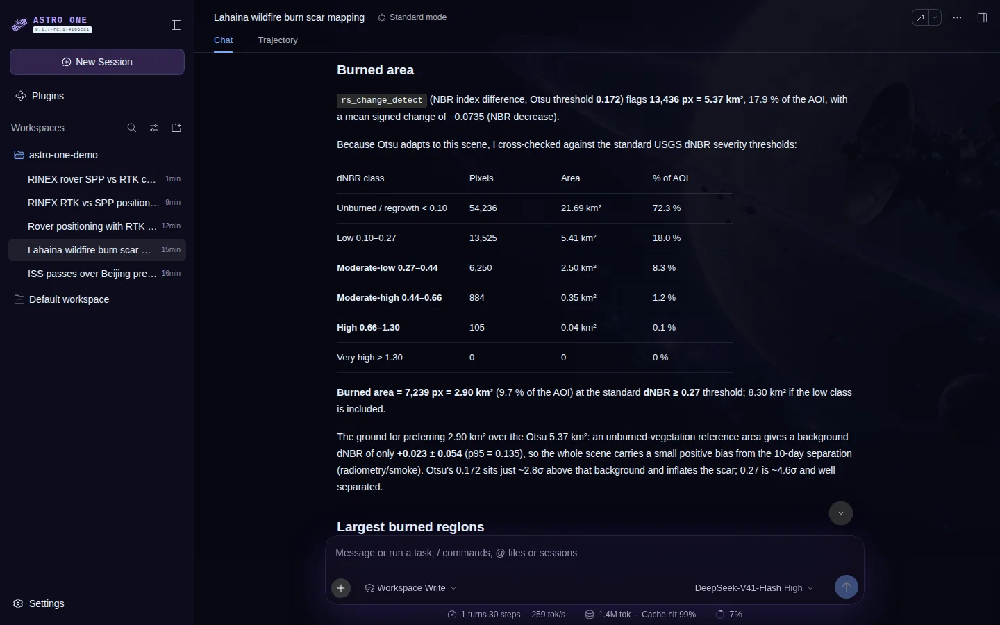
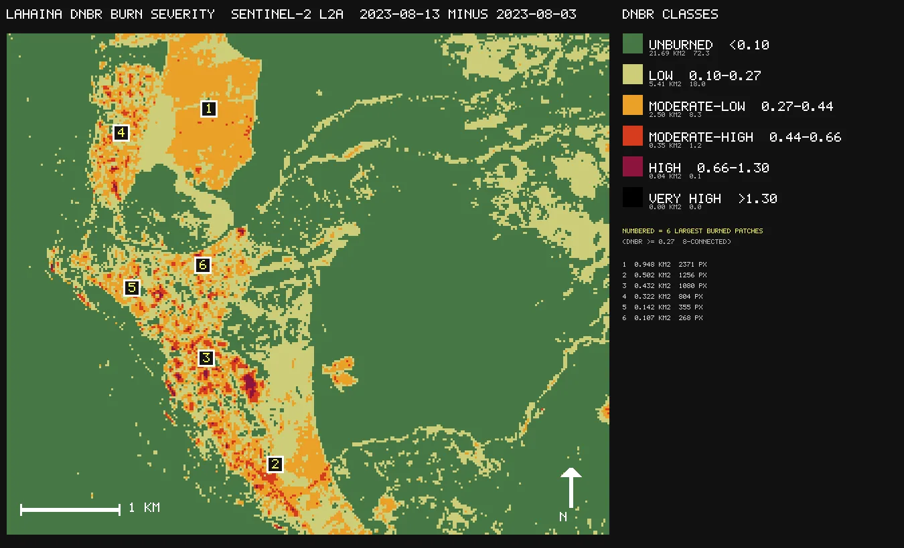
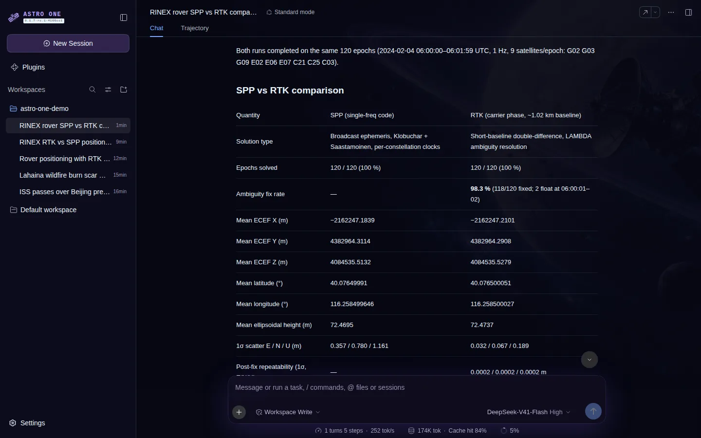
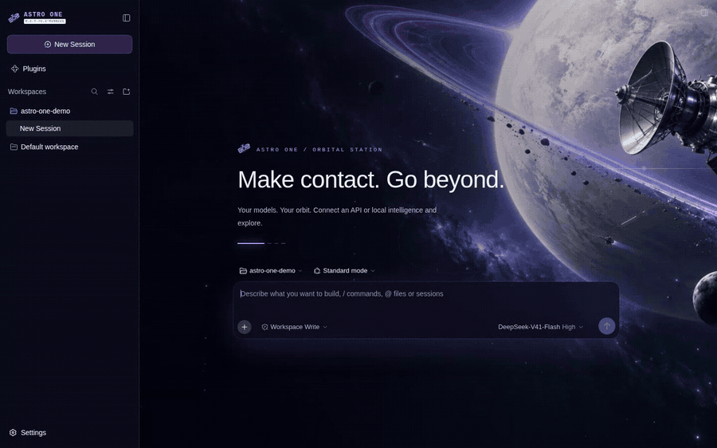
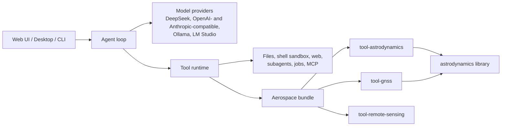

# Astro One

English | [中文](README.zh.md)

**An AI agent workbench for spaceflight engineering.** Astro One gives a language model real astrodynamics, GNSS, and Earth-observation tools, so it can predict passes, determine orbits, position receivers, and map changes in satellite imagery from the files in your workspace, then show every step it took.



Astro One builds on [DeepSeek Harness](https://github.com/deepseek-ai/deepseek-harness), the open-source agent harness from [DeepSeek AI](https://deepseek.com), and keeps its **everything-is-a-plugin** architecture powered by [Cordis](https://github.com/cordiverse/cordis) ([_A Programming Paradigm for Spatiotemporal Composability_](https://arxiv.org/abs/2608.25512)). On top of it, Astro One adds an aerospace algorithm library, eleven model-facing aerospace tools, and a space-themed Web and desktop interface.

## Why Astro One

- **Real algorithms, not guesses.** Orbits come from SGP4 and an RKF7(8) force-model integrator, positions from least squares with RAIM and RTK with LAMBDA, burn scars from spectral indices with Otsu thresholding. The model calls the algorithm and reports what it returned.
- **Built for spaceflight data.** TLE and CCSDS OMM element sets, state vectors, tracking observations, RINEX 3 navigation and observation files, GeoTIFF and Cloud-Optimized GeoTIFF imagery, and ONNX detection models are first-class inputs.
- **Every step is visible.** The Trajectory view lists each tool call with its arguments and result, so you can check how an answer was produced.
- **Local first.** The algorithms run in-process on your machine and need no network service; only model requests leave the host. Shell commands run in a filesystem sandbox.
- **Bring your own model.** Use the DeepSeek API, any OpenAI- or Anthropic-compatible endpoint, or a local model served by Ollama or LM Studio.
- **Everything is a plugin.** Aerospace support is one optional bundle that you switch on from the Plugins page; the same mechanism adds tools, model providers, and UI.

## See it in action

The recordings below come from real sessions with the DeepSeek-V41-Flash model on the data files described next to each one. Animations are sped up.

### Orbit mechanics: when can I see the ISS?

The agent reads a current ISS TLE, calls `orbit_passes` with SGP4, checks illumination and the Sun's elevation at the site, and returns a pass table in Beijing time. It finds six passes above 10° on 29 September 2026; only the 18:53–18:59 evening pass (52° maximum elevation, Sun 11.5° below the horizon) is visible to the naked eye.



The Trajectory tab shows the exact calls behind the answer:



### Earth observation: mapping the Lahaina wildfire burn scar

Input: two Sentinel-2 L2A crops of Lahaina, Maui (6 km × 5 km, 20 m, bands B8A and B12) from 3 August and 13 August 2023, before and after the 8 August wildfire.



The agent runs `rs_change_detect` with the NBR index, which applies an Otsu threshold of 0.172 and flags 5.37 km² of change. It then cross-checks the result against the USGS dNBR severity classes (2.90 km² at dNBR ≥ 0.27) and explains the difference.



In the same session the agent drew this severity map with Python in its sandbox and delivered it as a file:



### GNSS: single-point positioning versus RTK

Input: 120 epochs of simulated RINEX 3 observations for a base station and a rover 1 km apart near Beijing, tracking GPS, Galileo, and BeiDou, with broadcast ephemerides. The agent runs `gnss_position` in SPP and RTK modes. RTK fixes integer ambiguities in 98.3 % of epochs and lands within 3 cm of the simulated truth, while single-point positioning scatters by about a metre.



### One switch to enable

Aerospace support ships as the optional `@astro-one/aerospace` bundle. Turn it on from **Plugins**; the tools are available in the next conversation.



## Aerospace toolset

| Area | Tool | What it does |
|---|---|---|
| Orbits | `orbit_propagate` | Ephemerides from SGP4 (TLE/OMM), RKF7(8) numerical propagation with J2–J6, drag, solar radiation pressure, and Sun/Moon gravity, or two-body motion; output in GCRF, ITRF, TEME, or geodetic coordinates |
| | `orbit_determine` | Gibbs, Herrick–Gibbs, and Gauss angles-only initial orbits; batch least squares with covariance and outlier editing; unscented Kalman filter; position, range, range-rate, RA/Dec, and Az/El observations |
| | `orbit_transfer` | Izzo Lambert solver with multi-revolution branches, Hohmann and bi-elliptic transfers, plane changes |
| | `orbit_passes` | Rise, culmination, and set times with look angles, satellite illumination, and site Sun elevation |
| | `orbit_conjunction` | Close-approach screening, RTN miss vectors, Foster 2D collision probability, Alfano maximum probability |
| | `orbit_convert` | State, element, and geodetic conversions; UTC, TT, TAI, GPS time, and sidereal time |
| Attitude | `attitude_determine` | TRIAD, Davenport q-method, and QUEST with Euler angles and 1-sigma errors |
| GNSS | `gnss_position` | RINEX 3 single-point positioning with Klobuchar and Saastamoinen corrections and RAIM, or short-baseline RTK with LAMBDA ambiguity fixing, for GPS, Galileo, and BeiDou (including GEO) |
| | `gnss_visibility` | Satellite sky view and GDOP/PDOP/HDOP/VDOP planning from a navigation file |
| Remote sensing | `rs_spectral_index` | NDVI, NDWI, MNDWI, NDBI, NBR, NDRE, NDSI, EVI, and SAVI with statistics, histograms, and class-area fractions |
| | `rs_change_detect` | Change-vector analysis or index differencing, Otsu thresholding, and 8-connected changed regions with map coordinates |
| | `rs_detect_objects` | Oriented object detection with a YOLO-OBB ONNX model (for example DOTA ships, planes, and vehicles), tiled inference, and rotated non-maximum suppression; enabled when you configure a model |

The [aerospace subsystem page](docs/subsystems/aerospace.md) lists units, reference frames, and the published source of every algorithm; the [generated tool catalog](docs/tool-catalog.md#astro-onetool-astrodynamics) has the exact schemas. Package documentation starts at [`packages/aerospace/`](packages/aerospace/README.md).

<a id="run"></a>

## Run

Astro One is in _developer preview_ and changes quickly; **expect breaking changes**. Read the [safety notice](SAFETY.md) before running it.

<a id="run-from-source"></a>

### Run from source

Packages are not yet published to npm, so run Astro One from a repository checkout with Node.js 22.19+ (or 24+) and pnpm:

```sh
git clone https://github.com/ZengyingYue/astro-one.git
cd astro-one
pnpm install
pnpm run build
pnpm astro-one web
```

The Web UI opens at `http://127.0.0.1:3080`. Then:

1. Open **Settings → Models** and connect a model: set `DEEPSEEK_API_KEY`, add an OpenAI- or Anthropic-compatible endpoint, or point to a local Ollama or LM Studio server.
2. Open **Plugins** and switch on **Aerospace**.
3. Add a workspace folder that holds your TLEs, RINEX files, or imagery, and ask a question.

Shell commands run inside a sandbox. On Linux the sandbox needs [bubblewrap](https://github.com/containers/bubblewrap) with unprivileged user namespaces allowed, or the Landlock launcher built with `node --import tsx/esm native/system/scripts/build.ts` (requires `musl-gcc`). Without either, the agent still has its file and aerospace tools but cannot run shell commands.

For terminal and headless use, add `@astro-one/aerospace` to a profile's bundles as described in the [bundle README](packages/bundle/aerospace/README.md); the [remote-sensing README](packages/aerospace/tool-remote-sensing/README.md#enable-object-detection) shows how to configure an object-detection model. The [Web UI guide](docs/user/guide/index.md) covers the rest of the interface.

## Architecture



Every box is a Cordis plugin loaded from a profile. Sessions are append-only logs, so every model-visible input can be replayed. Start with the [architecture guide](docs/architecture.md) and the [package map](packages/README.md).

## Development

Start with the [development guide](docs/development.md). `pnpm run dev:web` builds, serves, and rebuilds client bundles on source edits, and `make help` lists the matching Make targets for Web and Desktop. See [CONTRIBUTING.md](CONTRIBUTING.md) for contributions and [AGENTS.md](AGENTS.md) for coding agents. Add the [`astro-one-plugin`](https://github.com/topics/astro-one-plugin) topic to plugin repositories so others can find them.

## Acknowledgements

Astro One builds on DeepSeek Harness by DeepSeek AI and on Cordis. The aerospace tools use [satellite.js](https://github.com/shashwatak/satellite-js), [geotiff.js](https://github.com/geotiffjs/geotiff.js), [sharp](https://sharp.pixelplumbing.com/), and [ONNX Runtime](https://onnxruntime.ai/). The demonstration imagery contains modified Copernicus Sentinel data (2023) obtained through [Element 84 Earth Search](https://earth-search.aws.element84.com/v1); the ISS element set comes from [CelesTrak](https://celestrak.org/).

If you use the underlying harness in research, please cite DeepSeek Harness:

```bibtex
@misc{deepseek-harness2026,
  title={DeepSeek Harness: Everything is a Plugin},
  author={DeepSeek-AI},
  year={2026},
  publisher={GitHub},
  howpublished={\url{https://github.com/deepseek-ai/deepseek-harness}},
}
```

## License

[MIT](LICENSE). Third-party dependencies and their licenses are disclosed in [THIRD_PARTY_NOTICES.md](THIRD_PARTY_NOTICES.md).
