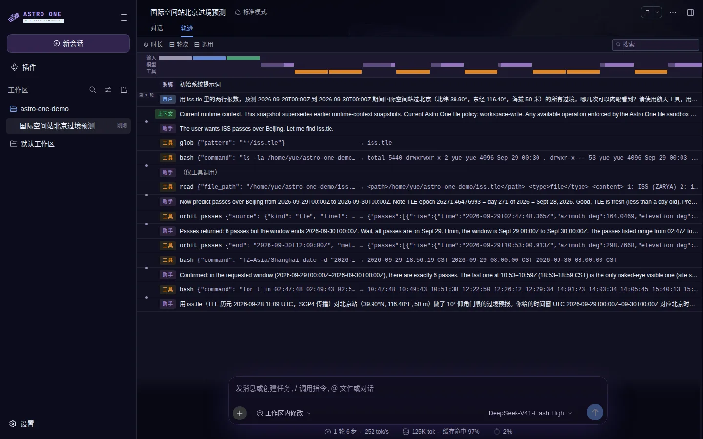
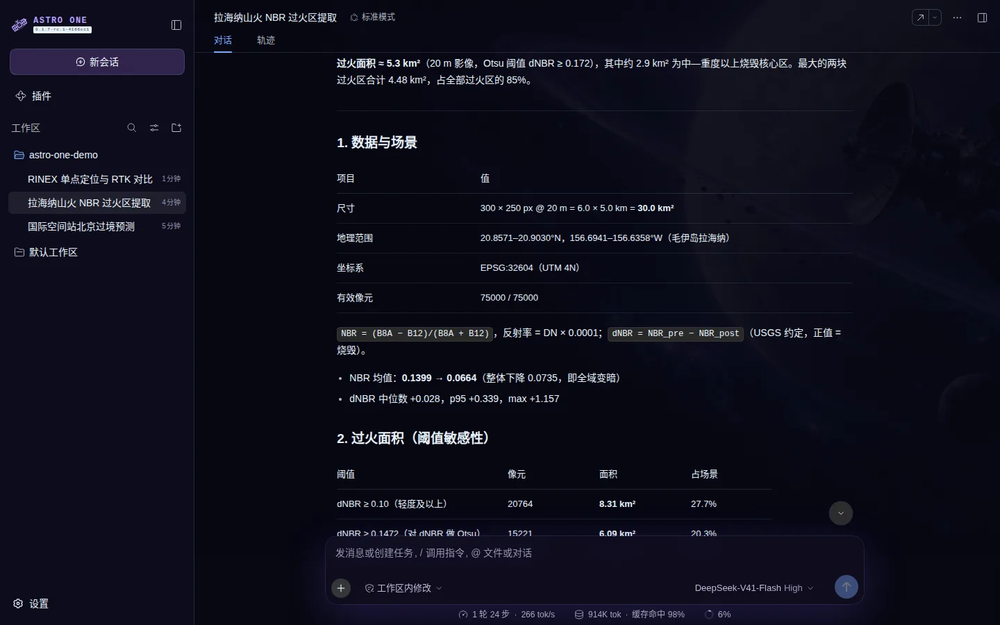
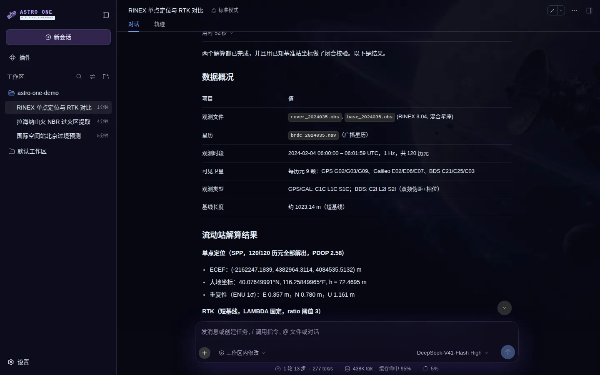
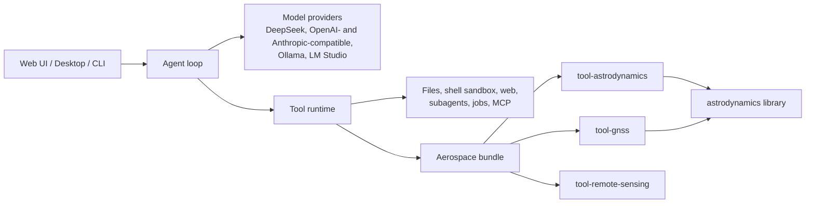

# Astro One

[English](README.md) | 中文

**面向航天工程的 AI 智能体工作台。** Astro One 为大语言模型配备真正的轨道力学、GNSS 定位与对地观测工具，让它能直接读取工作区里的文件，完成过境预报、轨道确定、接收机定位和卫星影像变化分析，并把每一步操作完整展示出来。


Astro One 基于 [DeepSeek Harness](https://github.com/deepseek-ai/deepseek-harness) 构建——这是 [DeepSeek AI](https://deepseek.com) 开源的智能体框架。Astro One 沿用了它由 [Cordis](https://github.com/cordiverse/cordis) 驱动的**一切皆插件**架构（设计见论文 [_A Programming Paradigm for Spatiotemporal Composability_](https://arxiv.org/abs/2608.25512)）。在此之上，Astro One 新增了航天算法库、11 个面向模型的航天工具，以及太空主题的 Web 与桌面界面。

## 为什么选择 Astro One

- **真实算法，而非猜测。** 轨道由 SGP4 和 RKF7(8) 摄动积分器计算，定位由带 RAIM 的最小二乘和带 LAMBDA 的 RTK 解算，过火区由光谱指数加 Otsu 阈值提取。模型调用算法，并如实报告算法返回的结果。
- **原生支持航天数据。** TLE 与 CCSDS OMM 根数、状态矢量、跟踪观测、RINEX 3 导航与观测文件、GeoTIFF 与云优化 GeoTIFF 影像、ONNX 检测模型都是一等输入。
- **每一步都可追溯。** “轨迹”视图列出每一次工具调用的参数和返回值，答案是怎么得出的一目了然。
- **本地优先。** 算法在本机进程内运行，不依赖任何网络服务；离开本机的只有模型请求。Shell 命令在文件系统沙箱中执行。
- **模型自由选择。** 可接入 DeepSeek API、任意 OpenAI 或 Anthropic 兼容接口，或 Ollama、LM Studio 提供的本地模型。
- **一切皆插件。** 航天能力是一个可选 bundle，在插件页一键开启；同样的机制也用于扩展工具、模型提供方和界面。

## 实际效果

以下录屏均来自使用 DeepSeek-V41-Flash 模型的真实会话，所用数据在各段说明中列出。动图经过加速。

### 轨道力学：什么时候能看到国际空间站？

智能体读取最新的国际空间站 TLE，用 SGP4 调用 `orbit_passes`，检查卫星受照情况和测站太阳高度角，然后按北京时间给出过境表。2026 年 9 月 29 日共有 6 次仰角高于 10° 的过境，其中只有傍晚 18:53–18:59 那一次（最大仰角 52°，太阳位于地平线下约 12°）可以肉眼看到。


“轨迹”标签页展示了得出答案的每一次调用：



### 对地观测：提取拉海纳山火过火区

输入：2023 年 8 月 3 日与 8 月 13 日（8 月 8 日山火前后）夏威夷毛伊岛拉海纳的两幅哨兵二号 L2A 裁剪影像，范围 6 km × 5 km，分辨率 20 m，波段 B8A 与 B12。


智能体用 NBR 指数调用 `rs_change_detect`，按 Otsu 阈值 0.172 提取出约 5.3 km² 的变化区域；再对照 USGS dNBR 烧伤等级，计算中度及以上烧毁区约 2.9 km²，并解释两者差异的原因。



在英文演示会话中，智能体还在沙箱里用 Python 绘制了这张烧伤严重度图，并作为文件交付：


### GNSS：单点定位与 RTK 对比

输入：北京附近相距约 1 km 的基准站与流动站的 120 个历元模拟 RINEX 3 观测数据，包含 GPS、Galileo 和北斗，以及广播星历。智能体用 `gnss_position` 分别进行单点定位和 RTK 解算。RTK 在 98.3% 的历元固定了整周模糊度，与模拟真值相差不到 3 cm；单点定位的离散度约为 1 米量级。



### 一键启用

航天能力以可选的 `@astro-one/aerospace` bundle 发布。在**插件**页打开开关，下一次对话即可使用这些工具。


## 航天工具集

| 领域 | 工具 | 功能 |
|---|---|---|
| 轨道 | `orbit_propagate` | 用 SGP4（TLE/OMM）、RKF7(8) 数值外推（J2–J6、大气阻力、太阳光压、日月引力）或二体模型生成星历；输出 GCRF、ITRF、TEME 或大地坐标 |
| | `orbit_determine` | Gibbs、Herrick–Gibbs 与 Gauss 仅测角初始定轨；带协方差和野值剔除的批处理最小二乘；无迹卡尔曼滤波；支持位置、距离、距离变化率、赤经赤纬和方位仰角观测 |
| | `orbit_transfer` | 支持多圈分支的 Izzo Lambert 求解器、Hohmann 与双椭圆转移、轨道面变更 |
| | `orbit_passes` | 升起、中天、降落时刻及观测角、卫星受照情况和测站太阳高度角 |
| | `orbit_conjunction` | 近距离交会筛查、RTN 脱靶矢量、Foster 2D 碰撞概率、Alfano 最大概率 |
| | `orbit_convert` | 状态、根数与大地坐标转换；UTC、TT、TAI、GPS 时间与恒星时 |
| 姿态 | `attitude_determine` | TRIAD、Davenport q-method 与 QUEST，给出欧拉角和 1-sigma 误差 |
| GNSS | `gnss_position` | 基于 RINEX 3 的单点定位（Klobuchar、Saastamoinen 改正与 RAIM），或带 LAMBDA 模糊度固定的短基线 RTK；支持 GPS、Galileo 和北斗（含 GEO） |
| | `gnss_visibility` | 基于导航文件的卫星天空分布与 GDOP/PDOP/HDOP/VDOP 规划 |
| 遥感 | `rs_spectral_index` | NDVI、NDWI、MNDWI、NDBI、NBR、NDRE、NDSI、EVI 与 SAVI，附统计量、直方图和分类面积比例 |
| | `rs_change_detect` | 变化矢量分析或指数差分、Otsu 阈值、带地图坐标的 8 连通变化区域 |
| | `rs_detect_objects` | 基于 YOLO-OBB ONNX 模型的旋转目标检测（如 DOTA 数据集中的船只、飞机、车辆），支持分块推理与旋转非极大值抑制；配置模型后启用 |

[航天子系统页面](docs/subsystems/aerospace.zh.md)列出了单位、参考系以及每个算法的文献来源；[生成的工具目录](docs/tool-catalog.zh.md#astro-onetool-astrodynamics)给出了精确的 schema。包文档从 [`packages/aerospace/`](packages/aerospace/README.zh.md) 开始。

<a id="run"></a>

## 运行

Astro One 处于*开发者预览*阶段，迭代很快，**会有不兼容的变更**。运行前请阅读[安全须知](SAFETY.zh.md)。

<a id="run-from-source"></a>

### 从源码运行

目前各包尚未发布到 npm，请用 Node.js 22.19+（或 24+）和 pnpm 从仓库检出目录运行：

```sh
git clone https://github.com/ZengyingYue/astro-one.git
cd astro-one
pnpm install
pnpm run build
pnpm astro-one web
```

Web 界面默认在 `http://127.0.0.1:3080` 打开。之后：

1. 打开**设置 → 模型**连接模型：设置 `DEEPSEEK_API_KEY`，添加 OpenAI 或 Anthropic 兼容接口，或指向本地的 Ollama、LM Studio 服务。
2. 打开**插件**，开启**航天**。
3. 添加存放 TLE、RINEX 文件或影像的工作区文件夹，然后提问。

Shell 命令在沙箱中执行。在 Linux 上，沙箱需要允许非特权用户命名空间的 [bubblewrap](https://github.com/containers/bubblewrap)，或用 `node --import tsx/esm native/system/scripts/build.ts` 构建的 Landlock 启动器（需要 `musl-gcc`）。两者都不可用时，智能体仍可使用文件和航天工具，但不能执行 Shell 命令。

在终端或 headless 模式下使用时，按 [bundle README](packages/bundle/aerospace/README.zh.md) 的说明把 `@astro-one/aerospace` 加入 profile 的 bundles；[遥感 README](packages/aerospace/tool-remote-sensing/README.zh.md#enable-object-detection) 介绍了如何配置目标检测模型。界面的其他用法见 [Web 界面指南](docs/user/guide/index.zh.md)。

## 架构



图中每个方框都是从 profile 加载的 Cordis 插件。会话以只追加日志保存，因此每一项模型可见的输入都能回放。建议从[架构文档](docs/architecture.zh.md)和[包映射](packages/README.zh.md)开始阅读。

## 开发

请先阅读[开发指南](docs/development.zh.md)。`pnpm run dev:web` 会构建并启动服务，在源码修改时重新构建客户端 bundle；`make help` 列出 Web 与桌面端对应的 Make 目标。贡献方式见 [CONTRIBUTING.zh.md](CONTRIBUTING.zh.md)，编码智能体请遵循 [AGENTS.md](AGENTS.md)。为插件仓库添加 [`astro-one-plugin`](https://github.com/topics/astro-one-plugin) 话题，方便他人发现。

## 致谢

Astro One 基于 DeepSeek AI 的 DeepSeek Harness 与 Cordis 构建。航天工具使用了 [satellite.js](https://github.com/shashwatak/satellite-js)、[geotiff.js](https://github.com/geotiffjs/geotiff.js)、[sharp](https://sharp.pixelplumbing.com/) 和 [ONNX Runtime](https://onnxruntime.ai/)。演示影像包含经过处理的 Copernicus 哨兵数据（2023），通过 [Element 84 Earth Search](https://earth-search.aws.element84.com/v1) 获取；国际空间站根数来自 [CelesTrak](https://celestrak.org/)。

如在研究中使用底层框架，请引用 DeepSeek Harness：

```bibtex
@misc{deepseek-harness2026,
  title={DeepSeek Harness: Everything is a Plugin},
  author={DeepSeek-AI},
  year={2026},
  publisher={GitHub},
  howpublished={\url{https://github.com/deepseek-ai/deepseek-harness}},
}
```

## 许可证

[MIT](LICENSE)。第三方依赖及其许可证见 [THIRD_PARTY_NOTICES.md](THIRD_PARTY_NOTICES.md)。
